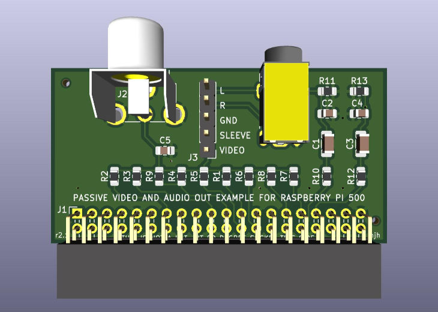

# Passive A/V example circuit for Raspberry Pi 500

This simple circuit demonstrates composite video and audio out from Raspberry Pi 5 series computers, using only passive components (it cannot produce composite video from Raspberry Pi 400 or earlier models). The board was designed using KiCad 9.0

Video and audio quality are limited. There may be crosstalk between them, and power supply noise. The circuit may nevertheless be useful for less-demanding applications.

This is not an official product. It has not undergone regulatory testing, and does not conform to HAT guidelines.



## Quick instructions

 * Ensure you can log in remotely, in case you end up with no display.
 * `dtoverlay=vc4-drm-kms-v3d,composite` (or use `raspi-config` to enable composite).
 * `dtoverlay=vec-gpio-pi5,gpio27` (this overlay might not exist yet...)
 * `dtoverlay=audremap,pins_12_13`
 * Optionally, set a video mode in `cmdline.txt` (the default will be 704x432i NTSC).
 * Power off before connecting anything.
 * Connect to Raspberry Pi 500 or 500+, ensuring connector is centrally aligned and covers all header pins! Component side up.
 * or install vertically on a Raspberry Pi 5 or CM5IO header, with component side facing towards the Raspberry Pi's HDMI ports.
 * To get both audio and video through the jack socket, connect a jumper between VIDEO and SLEEVE pins.
 * Unplug HDMI before booting with composite video enabled.

After reboot, there might be no picture (until the new overlay is released). You may need to type:

```
   pinctrl 4-11,27 a1
```

## Circuit notes

### Video

On the RP1 chip, three copies of an 8-bit signal from the VEC (video encoder) can be brought out to GPIO pins 4-27, with an optional clock on GPIO 0 (rather like DPI). It is usually clocked at 108 MHz.

Here we use a simple 7-bit resistor DAC. To improve linearity, the MSB is driven by two separate GPIOs (11 and 27).

Resistor values were chosen from JLCPCB's "Basic" range (mostly E12) to approximate the sequence (490 x 2<sup><i>n</i></sup>) - 20 ohms. More precise values for R5 and R7 might be 1.96K, 7.87K.

The output is DC-coupled with an impedance of 120 ohms. Peak output is about 1.25 V into a 75 ohm load.

### Audio

This is a variant of the PWM filter used in some Raspberry Pi models, omitting the regulator and buffer for simplicity.

Although intended for use with a TV or amplifier, the circuit can (quietly) drive headphones with impedance >= 32 ohms.

### Passive components

| Designator | Value |Footprint |JLCPCB part #|
|------------|-------|----------|----------|
| R1-R3 | 470 | 0805 |C17710|
| R4    | 1K  | 0805 |C17513|
| R5    | 2K  | 0805 |C17604|
| R6    | 3.9K  | 0805 |C17614|
| R7    | 8.2K  | 0805 |C17828|
| R8    | 15K  | 0805 |C17475|
| R9    | 22K  | 0805 |C17560|
| R10, R12 | 220  | 0805 |C17557|
| R11, R13 | 100  | 0805 |C17408|
| C1, C3 | 22uF | 1206 |C12891|
| C2, C4 | 100nF | 0805 |C49678|
| C5 | 100pF | 0805 |C1790|

Resistors should be 1% (especially R1-R4). C1, C3 are unpolarized; 10% tolerance and 10V rating are fine. A higher rating or larger package might improve quality.

### Connectors

J2 is Same Sky RCJ-014. Other sockets exist with similar footprints.

J4 is Tensility 54-00174. There are other similar-shaped TRRS sockets (some bending of pins may be required).

The unusual choice of a right-angle socket for J1 was made with Raspberry Pi 500 in mind. Do not fit a socket on the underside! You would have to change the layout to adapt the board to HAT form factor.


### A note on missing files

The repository does not include any footprint or symbol libraries. Footprints for J2 and J4 are available from SnapMagic Search, Inc.

Note that I **changed their pin numbers** to match KiCad's symbols, trimmed silkscreen at board edges, and modified KiCad's `Raspberry_Pi_2_3` symbol to separate the GND pins.
